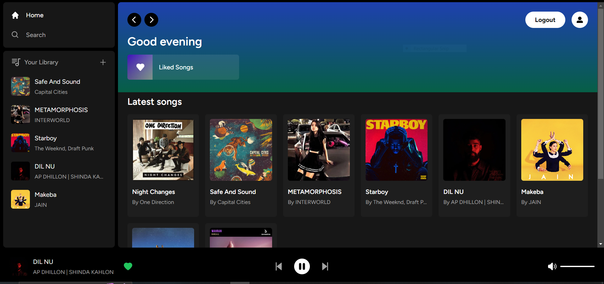
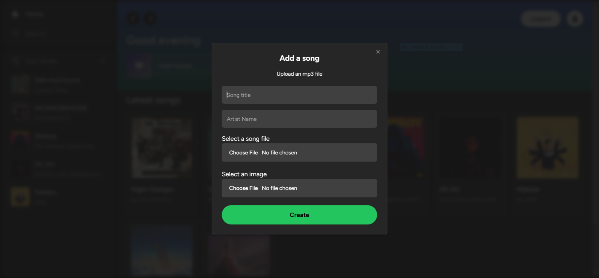
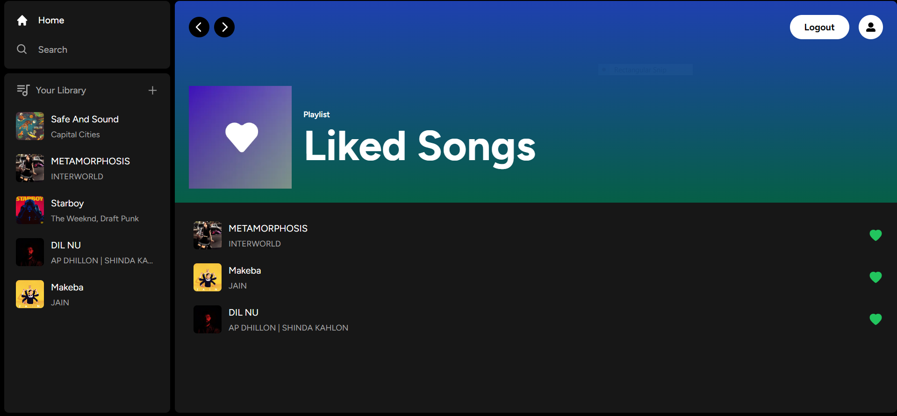
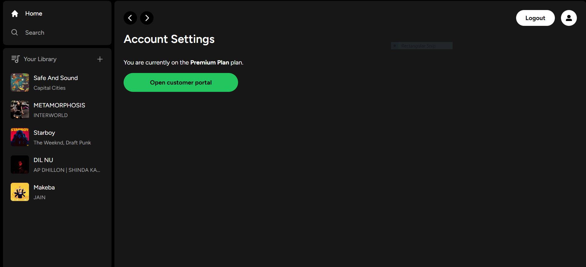
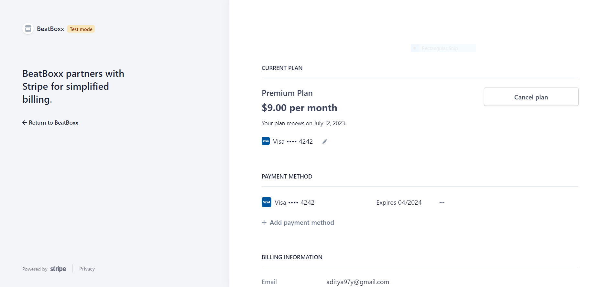
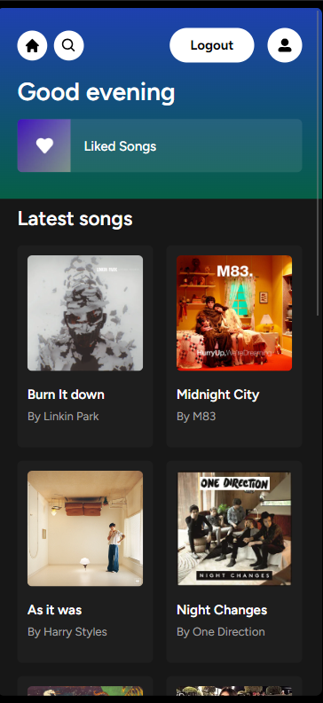

# Beatboxx | Music Web Application

Welcome to the Music Web Application repository! This project aims to provide users with a feature-rich, fully responsive music streaming platform similar to Spotify. Users can discover, listen to, and upload their own songs seamlessly on any device. The application is built using Next.js13, React, TypeScript, and Supabase, offering a delightful and consistent user experience across various screen sizes.


## Demo

https://beatboxx.vercel.app/

## Project Demo video
https://youtu.be/MWWtlCL7dP4


## Features

- Stream and listen to a vast collection of songs across various genres, artists, and albums.
- Upload and share your own music creations with the community.
- Curate your favorite songs in the Liked Library for easy access.
- Free subscription allows users to upload one song, while premium subscription offers unlimited uploads and exclusive perks.
- Integrated Stripe payment gateway in test mode for secure and convenient subscription upgrades.
- Robust authentication system requiring sign up or login to access the app's features.
- Play, pause, and control the volume of the currently playing song.
- Navigate to the next or previous song in the playlist.


## Screenshots


 **Add songs by clicking on plus button in my library** 

Liked songs page


**Handle Subscription in my account**



**Full Responsive**




## Tech Stack

- **Next.js:** A React framework for server-side rendering and building scalable web applications.
- **React:** A popular JavaScript library for building user interfaces.
- **TypeScript:** A typed superset of JavaScript that enhances code quality and developer productivity.
- **Supabase:** An open-source Firebase alternative that provides a backend-as-a-service (BaaS) platform for data storage, authentication, and real-time functionalities.
- **Stripe:** A widely-used payment gateway for securely handling subscription payments and transactions.
- **Tailwind CSS:** A highly customizable CSS framework that provides utility classes for building responsive and modern user interfaces.
- **PostgreSQL:** An open-source relational database management system used for storing and managing the application's data.

## Installation

 1. Clone the repository:

 ```bash
  git clone https://github.com/adityayaduvanshi/Full-Stack-Music-Web-App.git
 ```
2. Install dependencies:    
```bash
 cd yourrepository
 npm install
```
3. Set up environment variables:  

 - Create a `.env.local` file in the root directory.
 - Add the following environment variables and replace the values with your own:
 ```bash
 NEXT_PUBLIC_SUPABASE_URL=your_supabase_url
 NEXT_PUBLIC_SUPABASE_ANON_KEY=your_supabase_anon_key
 SUPABASE_SERVICE_ROLE_KEY=your_supabase_service_role_key
 NEXT_PUBLIC_STRIPE_PUBLISHABLE_KEY=your_stripe_publishable_key
 STRIPE_SECRET_KEY=your_stripe_secret_key
 STRIPE_WEBHOOK_SECRET=your_stripe_webhook_secret
 ```
4. Run the application:
```bash
npm run dev
```
5. Open your browser and visit `http://localhost:3000` to access the application.

## Contributing
Contributions are welcome! If you'd like to contribute to this project, please follow these steps:

 1. Fork the repository.
 2. Create a new branch for your feature or bug fix.
 3. Make your changes and commit them with descriptive commit messages.
 4. Push your changes to your forked repository.
 5. Submit a pull request, explaining the changes you've made.

Please make sure to adhere to the existing code style and guidelines.


## Contact

- Email: aditya.yadsr@gmail.com
- Twitter: @fixslyr


